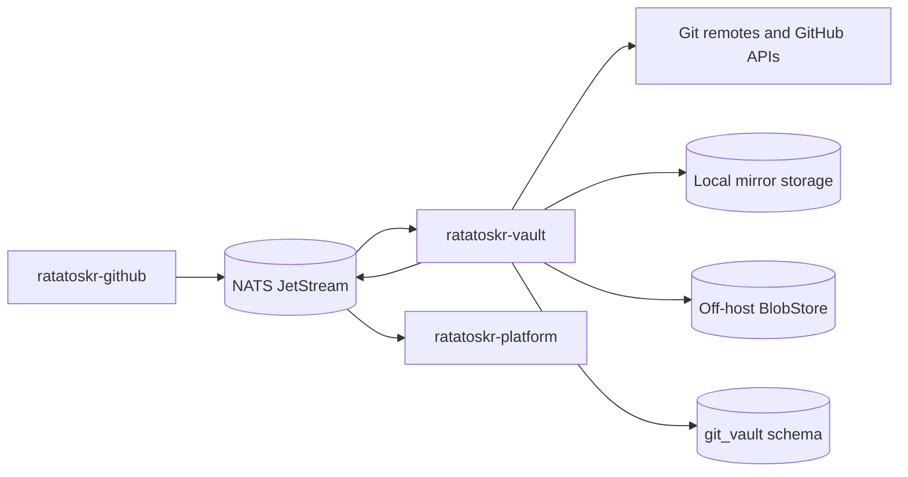
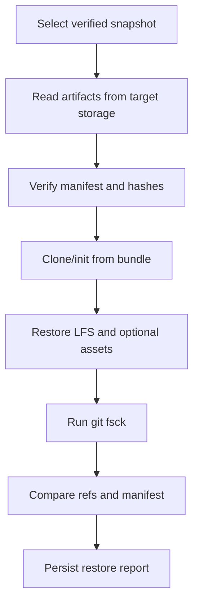

# Ratatoskr Vault Architecture

> Status: target architecture. The Rust service foundation, operator health plane, current
> `git_vault` schema, CI gate, reconciliation, confined Git execution, and local mirror lifecycle
> are implemented. Local immutable bundle snapshots and manifests are implemented; restore,
> retention, off-host storage, and the remaining sections are planned.

## 1. Purpose

`ratatoskr-vault` preserves Git repositories and related repository assets in a form that can be independently verified and restored.

Vault owns physical preservation:

- bare Git mirrors;
- Git LFS objects;
- immutable Git bundles and manifests;
- optional wiki, release, issue, pull-request, and discussion collectors;
- local and off-host object storage;
- integrity checks;
- restore drills;
- retention, tombstones, and deletion execution;
- actual backup state.

Vault does not decide whether a repository should be starred, listed, watched, or analyzed. `ratatoskr-github` owns those semantics and publishes desired backup policy.

## 2. Architectural position



Catalog states what is desired. Vault continually reconciles actual preservation state with the latest desired-state revision.

## 3. Repository structure

```text
ratatoskr-vault/
├── crates/
│   ├── vault-domain/
│   ├── desired-state/
│   ├── reconciliation/
│   ├── git-runner/
│   ├── mirror-store/
│   ├── snapshot-engine/
│   ├── lfs-collector/
│   ├── archive-collectors/
│   ├── manifests/
│   ├── blob-store/
│   ├── restore-verifier/
│   ├── retention/
│   ├── persistence/
│   ├── eventing/
│   ├── telemetry/
│   └── test-support/
├── services/
│   └── vault/
├── tools/
│   └── restore-verifier/
├── schema.sql
├── fixtures/
├── tests/
└── docs/
```

Workers may be split into runtime roles later, but they remain one bounded context and one repository.

## 4. Bounded context and data ownership

Recommended schema:

```text
git_vault.targets
git_vault.desired_state_revisions
git_vault.mirrors
git_vault.sync_runs
git_vault.snapshots
git_vault.snapshot_artifacts
git_vault.manifests
git_vault.integrity_checks
git_vault.restore_drills
git_vault.retention_policies
git_vault.tombstones
git_vault.storage_locations
git_vault.collector_runs
git_vault.outbox
git_vault.inbox
```

Vault stores references to Catalog repository identity, but it does not write Catalog tables or infer star semantics.

## 5. Desired-state model

A desired-state event identifies:

- stable repository identity;
- clone/source references;
- desired preservation level;
- policy revision;
- pin and retention settings;
- optional asset collectors;
- off-host requirement;
- credential reference or access strategy;
- correlation and actor metadata.

Preservation levels:

```text
none
metadata_only
git_mirror
git_mirror_with_lfs
complete_archive
```

### 5.1. Revision handling

Desired state is versioned. Vault records the latest accepted revision and ignores older duplicate/out-of-order revisions.

A new revision does not interrupt an already safe operation unless continuing would violate security, access, or deletion policy. The reconciler computes the next idempotent action from desired and actual state.

### 5.2. Pin precedence

A pinned target cannot be deleted by an automatic unstar-derived policy change. Explicit unpin and retention evaluation are required.

## 6. Target state machine

```text
requested
-> cloning
-> ready
-> fetching
-> snapshotting
-> verifying
-> healthy
```

Alternative states:

```text
degraded
paused
excluded
auth_required
quota_exceeded
deleting
deleted
```

Transitions are explicit, persisted, and idempotent. State is not inferred from nullable timestamps.

### 6.1. Health

A target is `healthy` only when:

- the latest required mirror update succeeded;
- the current snapshot artifacts exist;
- integrity checks passed;
- required off-host copies are verified;
- the configured restore-verification freshness is satisfied.

A successful `git fetch` alone is not healthy backup evidence.

## 7. Git execution architecture

Vault uses the system Git CLI through `tokio::process::Command`.

Reasons:

- complete ref and mirror semantics;
- compatibility with `git bundle` and `git fsck`;
- Git LFS tooling;
- transparent restore procedures;
- easier operational diagnosis.

### 7.1. Execution constraints

- no shell interpolation;
- allowlisted executable and subcommands;
- argument arrays only;
- dedicated Unix user;
- sanitized environment;
- explicit working directory;
- disabled hooks;
- disabled interactive prompts;
- process-group creation and cancellation;
- wall-clock timeout;
- CPU, memory, file-count, and disk quotas;
- stdout/stderr size limits;
- safe credential injection without command-line exposure.

### 7.2. Hostile repository model

Repositories are untrusted inputs. Threats include:

- malicious hooks;
- unsafe filters and smudge/clean drivers;
- submodule URLs;
- path collisions and unusual ref names;
- object bombs and extreme history;
- LFS pointer abuse;
- credential prompts;
- oversized output;
- filesystem symlink tricks.

Vault never checks out a working tree for ordinary mirror preservation. Operations that require checkout use a separate constrained path and policy.

## 8. Mirror architecture

### 8.1. Initial mirror

Typical flow:

```text
git clone --mirror <source> <target>
-> validate resulting directory
-> enumerate refs
-> git fsck --full
-> record mirror metadata
```

Implemented lifecycle boundary: the clone first reserves finite per-mirror and global capacity,
writes only to `work/runs/<run-id>/`, and renames the checked bare mirror into its identifier-derived
published path. Refusal writes quota evidence and degrades the target without pruning. Cancellation
removes only that run-owned staging tree and records `clone_pending`.

### 8.2. Update

```text
git fetch <source> +refs/*:refs/*
-> capture changed refs
-> git fsck --full
-> update mirror observation
-> decide whether a new snapshot is required
```

Updates use a per-target lease so two workers cannot mutate one mirror concurrently. The current
single-host executor also has one shared four-permit limit, aligned to the deployment target's four
CPU cores. An interrupted fetch never removes the published mirror; it records `fetch_pending` and
the next normal cycle retries fetch. Every clone and fetch runs fsck, show-ref, and object-count
sanity checks; failed checks mark the target degraded and preserve the last successful observation.

### 8.3. Mirror layout

Local paths are derived from internal IDs, never raw owner/repository names.

```text
<root>/mirrors/<shard>/<target-id>.git
<root>/work/<operation-id>/
<root>/quarantine/<operation-id>/
```

The database is authoritative for path ownership. Directory discovery alone does not create targets.

## 9. Snapshot architecture

A snapshot is an immutable preservation point associated with a mirror observation and manifest.

### 9.1. Git bundle

Default portable artifact:

```text
git bundle create <artifact> --all
git bundle verify <artifact>
```

Full bundles are the initial strategy because they simplify restore and reduce dependency-chain risk. Incremental bundles may be introduced only with explicit chain manifests and restore tests.

The implemented local slice builds `git bundle create <artifact> --all`, records the complete
`show-ref` evidence, and persists the immutable BlobRefs with status `built`. It does not run
`git bundle verify`, publish an off-host replica, or claim a production restore result; those are
the next verification and placement slices.

### 9.2. Snapshot state machine

```text
building
-> built
-> verifying
-> verified
-> offsite_uploading
-> offsite_verified
-> restore_testing
-> restorable
```

Failure states retain artifacts for diagnosis when policy allows:

```text
failed
-> quarantined
-> expired
-> deleted
```

### 9.3. Snapshot identity

Snapshot identity includes:

- target ID;
- mirror/ref observation hash;
- snapshot format and version;
- collector set;
- tool versions;
- creation policy revision.

Repeating the same request is idempotent.

## 10. Manifest architecture

Every snapshot has a signed or integrity-protected manifest.

```json
{
  "repository_id": "github:123456",
  "target_id": "018f0000-0000-7000-8000-000000000001",
  "source_url": "https://github.com/owner/repository",
  "created_at": "2026-08-17T10:00:00Z",
  "git_version": "2.x",
  "refs_hash": "sha256:...",
  "artifact_sha256": "sha256:...",
  "artifact_size": 123456789,
  "object_count": 12345,
  "includes_lfs": true,
  "includes_wiki": false,
  "fsck_result": "ok",
  "bundle_verify_result": "ok",
  "remote_verification_result": "ok",
  "restore_result": "ok",
  "schema_version": 1
}
```

The manifest references all component artifacts and their hashes. It is stored locally and off-host.

## 11. Git LFS architecture

A Git mirror alone does not preserve all LFS content.

For policies requiring LFS:

```text
inspect repository for LFS use
-> git lfs fetch --all
-> enumerate and hash LFS objects
-> package or upload content-addressed LFS objects
-> record object manifest
-> verify remote presence
-> include LFS restore step
```

LFS collection is separately retryable and can leave a snapshot in `assets_partial` or degraded state rather than falsely claiming completeness.

## 12. Complete archive collectors

`complete_archive` may include independent collectors for:

- Git refs and history;
- Git LFS;
- wiki repository;
- releases and release assets;
- issues and comments;
- pull requests and review metadata;
- discussions;
- selected repository settings;
- optional Actions artifacts under explicit policy.

Each collector has:

- a versioned input contract;
- its own cursor/checkpoint;
- raw artifact storage;
- completeness and warnings;
- rate-limit policy;
- restore/export procedure.

A complete archive is a manifest of verified component artifacts, not one opaque command.

## 13. BlobStore and off-host storage

Vault supports:

- local filesystem storage;
- S3-compatible storage;
- optional immutable/WORM storage.

Objects are content-addressed and verified after upload. A successful upload response is insufficient; Vault performs size/hash or provider-supported checksum verification.

Storage locations record:

- backend and bucket/root;
- object key;
- integrity metadata;
- encryption state;
- storage class;
- last verification;
- retention/immutability controls.

Required off-host policy blocks `healthy` status until a verified remote copy exists.

## 14. Restore verification

Backup success is proven by restoration.

### 14.1. Restore drill



Restore occurs in an isolated temporary directory, never over the active mirror.

### 14.2. Verification levels

```text
artifact_integrity
bundle_recreation
full_git_validation
asset_reconstruction
application-level export verification
```

Policy defines required level and freshness.

### 14.3. Independent verifier

The optional `restore-verifier` tool can run without the main Vault service, using a manifest and storage credentials. This prevents the backup implementation from being the only mechanism capable of reading its own artifacts.

## 15. Retention and deletion

### 15.1. Retention inputs

- explicit pin;
- target active/inactive state;
- grace period;
- snapshot count and age;
- off-host requirement;
- legal/user hold;
- storage pressure;
- successful replacement snapshot;
- last restore verification.

### 15.2. Unstar flow

```text
Catalog removes star-derived policy reason
-> desired state is recalculated
-> target may become inactive
-> grace period begins
-> tombstone is recorded
-> snapshots remain available
-> physical deletion occurs only when retention permits
```

Unstar never directly deletes artifacts.

### 15.3. Deletion workflow

Deletion is multi-stage:

1. Verify current desired-state revision and no pin/hold.
2. Create deletion plan with affected artifacts.
3. Mark target `deleting` and publish audit event.
4. Delete remote/local objects in controlled order.
5. Verify absence where supported.
6. Retain tombstone and manifest metadata.
7. Mark target `deleted`.

Retries are idempotent. Partial deletion is visible and recoverable.

## 16. Credentials and remote access

Vault may need Git or API access for private repositories.

Rules:

- credentials are referenced, not embedded in events;
- raw secrets never appear in command arguments or process output;
- Git credential helpers are scoped to one operation;
- SSH host verification is explicit;
- known-host policy is managed centrally;
- credentials are least-privilege and rotatable;
- Catalog and Vault credential responsibilities are documented per deployment;
- a credential failure transitions to `auth_required`, not repeated uncontrolled retries.

## 17. Reconciliation architecture

The reconciler is driven by desired-state revisions and periodic repair commands.

```text
load target and latest desired state
-> acquire target lease
-> inspect actual mirror/snapshot/storage state
-> compute one or more safe actions
-> execute action with durable transition
-> verify outcome
-> publish state event
-> release lease
```

Reconciliation is convergent. Replaying the same event or restarting a worker produces the same desired result without duplicate destructive effects.

## 18. Commands and events

### 18.1. Commands consumed

```text
vault.target.reconcile_requested.v1
vault.snapshot.create_requested.v1
vault.restore.verify_requested.v1
vault.target.pause_requested.v1
vault.target.delete_requested.v1
vault.storage.verify_requested.v1
```

### 18.2. Desired-state event consumed

```text
vault.target.desired.v1
```

### 18.3. Events emitted

```text
vault.target.state_changed.v1
vault.mirror.updated.v1
vault.snapshot.created.v1
vault.snapshot.verified.v1
vault.snapshot.degraded.v1
vault.restore.verified.v1
vault.restore.failed.v1
vault.target.auth_required.v1
vault.target.deleted.v1
```

Events contain references, hashes, and bounded diagnostics, not credentials or repository contents.

## 19. Persistence and transactions

Transactions group:

- state transitions;
- leases and operation records;
- manifest/artifact metadata;
- integrity results;
- outbox insertion.

Git, storage, and network operations occur outside database transactions. Durable intermediate states make interruption recoverable.

Inbox deduplication handles at-least-once command/event delivery.

## 20. Concurrency and capacity

Separate bounded pools manage:

- mirror clone/update;
- snapshot creation;
- LFS collection;
- off-host upload;
- restore verification;
- API asset collectors.

Limits may be global and per-host/account/storage backend.

Disk capacity management reserves headroom before starting large operations. The service refuses unsafe work rather than exhausting the host filesystem.

A per-target lease prevents concurrent mirror mutation, snapshot creation, and deletion conflicts.

## 21. Failure model

### Transient

- network or provider outage;
- temporary credential backend failure;
- storage throttling;
- event-bus or database outage;
- process interruption.

### Action-required

- credential revoked;
- repository access lost;
- disk quota exceeded;
- unsupported object/filter configuration;
- retention conflict or legal hold.

### Integrity failures

- `git fsck` failure;
- bundle verification failure;
- manifest/hash mismatch;
- missing LFS object;
- off-host checksum mismatch;
- restore ref mismatch.

Integrity failures never produce `healthy` status and are not hidden by a later upload success.

## 22. Security boundaries

- Git and archives are hostile input.
- No shell interpolation or unbounded subprocess output.
- Hooks, interactive prompts, external protocol handlers, and unsafe filters are disabled or controlled.
- Mirror and temporary paths derive from internal IDs.
- Symlinks and path traversal are rejected for archive collectors.
- Service runs under a dedicated Unix identity with constrained mounts.
- Restore drills use disposable directories.
- Credentials are short-lived or encrypted and never logged.
- BlobStore keys are opaque and least-privilege.
- Deletion requires current-policy verification and audit records.
- Vault has no access to unrelated provider tokens or user conversations.

## 23. Observability

Required telemetry:

```text
vault_targets_by_state
vault_reconcile_duration_seconds
git_process_duration_seconds
git_process_failures_total
mirror_bytes
snapshot_bytes
snapshot_creation_duration_seconds
snapshot_verification_failures_total
lfs_objects_total
lfs_missing_objects_total
blob_upload_duration_seconds
blob_verification_failures_total
restore_drill_duration_seconds
restore_drill_failures_total
retention_deletions_total
disk_free_bytes
queue_lag_seconds
```

Logs include target IDs, operation IDs, exit classifications, and hashes. They exclude remote credentials and repository file contents.

## 24. Testing architecture

### Unit and property tests

- desired-state precedence and revision ordering;
- state-machine transitions;
- manifest generation and validation;
- retention/deletion planning;
- safe path derivation;
- Git command construction without shell;
- idempotency and lease behavior.

### Integration

- local fixture repositories with branches, tags, unusual refs, and history;
- mirror clone/update and prune;
- bundle creation/verification;
- LFS fixtures;
- local/S3-compatible BlobStore upload and verification;
- database/outbox replay;
- credential failure transitions.

### Adversarial

- malicious hooks and config;
- path traversal and symlink fixtures;
- huge objects/history;
- invalid packs and missing objects;
- process timeout and cancellation;
- disk quota exhaustion;
- interrupted deletion.

### Restore acceptance

Every supported snapshot format has an automated restore test. Production readiness requires periodic workspace-level restore drills from off-host storage.

## 25. Deployment architecture

Default runtime roles may share one image:

```text
reconciler
mirror/snapshot worker
asset collector worker
restore verifier
retention worker
```

They use distinct concurrency limits and can be deployed separately.

Required mounts and dependencies:

- dedicated mirror/work filesystem;
- PostgreSQL `git_vault` role;
- NATS subjects for Vault only;
- BlobStore credentials;
- Git and optional Git LFS binaries;
- optional provider API credentials for complete-archive collectors.

Vault should be isolated more strongly than ordinary API services because it runs external processes and handles large untrusted repositories.

## 26. Migration architecture

Migration from legacy Git backup:

1. Import target and mirror metadata.
2. Map paths to stable target IDs.
3. Adopt existing bare mirrors without immediate reclone.
4. Run `git fsck --full` and quarantine failures.
5. Generate initial manifests and bundles.
6. Upload and verify off-host snapshots.
7. Perform restore drills.
8. Reconcile desired policies from Catalog.
9. Switch new enrollment to Vault.
10. Retire legacy workers only after restore acceptance criteria pass.

A legacy mirror is not considered a successful migrated backup until verification and restore evidence exist.

## 27. Architectural invariants

1. Catalog owns desired policy; Vault owns actual preservation state.
2. Backup success requires verification and restore evidence.
3. Git commands use the system CLI without shell interpolation.
4. Repositories, archives, paths, and process output are hostile input.
5. Mirror mutation is serialized per target.
6. Snapshots and manifests are immutable.
7. Required off-host copies are verified after upload.
8. Git LFS is a separate preservation layer.
9. Complete archive is a manifest of independent collectors.
10. Unstar never directly deletes backup data.
11. Pin and hold policies override automatic deletion.
12. Deletion is planned, audited, staged, and idempotent.
13. Desired-state revisions are ordered and replay-safe.
14. Integrity failure cannot be reported as healthy.
15. Vault never owns GitHub star/list semantics.

## 28. Evolution

Initial milestones:

1. Target/desired-state model, leases, and state machine.
2. Confined Git runner and local bare mirror lifecycle.
3. `git fsck`, full bundle creation, and manifest generation.
4. Local BlobStore and restore verifier.
5. S3-compatible off-host upload and checksum verification.
6. Git LFS collection and restore.
7. Retention, tombstones, and safe deletion.
8. Legacy mirror adoption and restore drills.
9. Wiki/releases/issues collectors for `complete_archive`.
10. Independent verifier tooling and production recovery runbooks.

Changes to snapshot formats, deletion semantics, or credential transfer require ADRs and coordinated workspace changesets.
